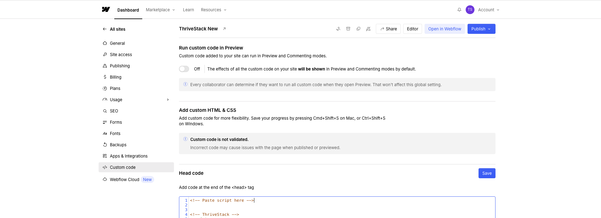

#### Integration Steps

1.  **Access WebFlow Project Settings**

    1.Open your WebFlow project dashboard
    2.Click on the Project Settings (gear icon) in the left sidebar
    3.Navigate to the Custom Code tab

    

2. **Add ThriveStack Script to WebFlow Site**


   ```html
   <!-- Add this in the <head> section of your WebFlow site -->
   <script src="https://d3cgzwt0fb6o2k.cloudfront.net/latest/thrivestack.js" 
       api-key="{API_KEY}" 
       source="marketing,product">
   </script>
   ```

3. **Initialize Analytics in JavaScript**
   ```javascript
   // Add this to your WebFlow site's custom code
   document.addEventListener('DOMContentLoaded', function() {
       // Track page view
       thrivestack.track("page_view", {
           page: window.location.pathname,
           title: document.title,
           site_name: "your-webflow-site"
       });
   });
   ```

4. **Track User Signup**
   ```javascript
   // Track WebFlow form submissions
   document.addEventListener('DOMContentLoaded', function() {
       // Track all form submissions
       document.querySelectorAll('form').forEach(form => {
           form.addEventListener('submit', function(e) {
               // Set user information
               thrivestack.setUser("18f716ac-37a4-464f-adb7-3cc30032308c", "john.doe@acme.xyz");
               
               // Set group information
               thrivestack.setGroup("ac8db7ba-5139-4911-ba6e-523fd9c4704b", "acme.com", "Acme Corporation");
               
               // Track signup completion
               thrivestack.track("signup_completed", {
                   platform: "webflow",
                   form_id: this.id || 'webflow-form',
                   source: "contact_form"
               });
           });
       });
   });
   ```

